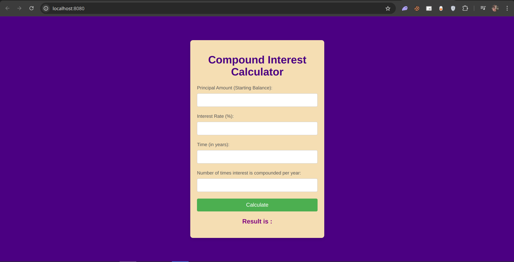

# Compound Interest Calculator

This is my compound interest calculator built with Java Servlets and JSP.

## Features
- Input validation for user data
- Compound interest calculation
- Easy to use interface

## How to Use
1. Enter the principle amount, interest rate, number of years, and compounding period.
2. Click the "Calculate" button to get the result.

## Technologies Used
- Maven
- Java Servlets
- JSP (JavaServer Pages)
- HTML/CSS
